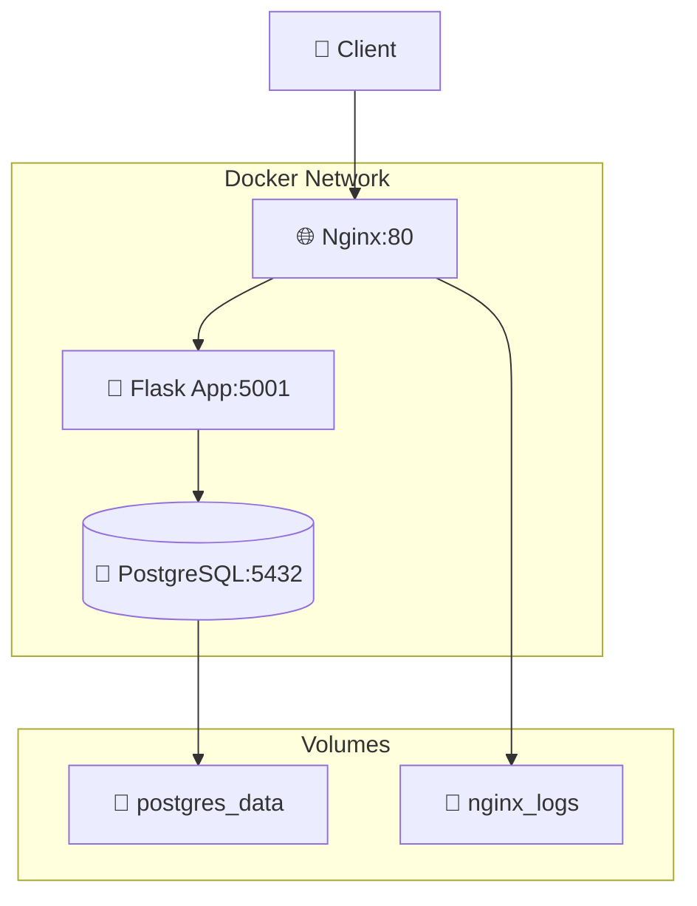

# Docker Compose Demo

A demonstration project for learning Docker Compose with Flask application, PostgreSQL, and Nginx.

## System Architecture



## System Components

| Service | Description | Port | Health Check |
|---------|-------------|------|--------------|
| **nginx** | Reverse proxy, load balancer | 80, 443 | ✅ |
| **web** | Flask Python application | 5001 | ✅ |
| **db** | PostgreSQL database | 5432 | ✅ |

## Project Structure

```
docker-compose-demo/
├── 📄 app.py			# Flask application
├── 📄 Dockerfile		# Flask image
├── 📄 docker-compose.yml	# Services configuration
├── 📄 docker-compose.prod.yml	# Production configuration
├── 📄 requirements.txt		# Python dependencies
├── 📄 .env			# Environment variables
├── 📄 .dockerignore		# Docker exceptions
├── 📄 .gitignore		# Git exceptions
├── 📄 Makefile			# Management commands
├── 📄 README.md		# Deatailed documentation 
├── 📄 CHANGELOG.md		# Changelog
├── 📁 nginx/
│   └── 📄 nginx.conf		# Nginx configuration
├── 📁 init-db/
│   └── 📄 01-init.sql		# Database initialization
└── 📁 .github/
    └── 📁 workflows/
        └── 📄 ci.yml		# CI/CD pipeline
```

## Quick Start

### Prerequisites

- Docker Engine 20.10+
- Docker Compose 2.0+
- Available ports: 80, 5001, 5432

### 1. Clone the Repository

```bash
git clone <your-repo-url>
cd docker-compose-demo
```

### 2. Start All Services

```bash
# Run in background mode
docker compose up -d

# Or with console logs
docker compose up
```

### 3. Check Services Status

```bash
# Status of all containers
docker compose ps

# Logs of all services
docker compose logs

# Logs of specific service
docker compose logs web
```

## Application Testing

### Main Endpoints

| Endpoint | Description | Example Response |
|----------|-------------|------------------|
| `GET /` | Main page | `{"message": "Hello, DevOps!"}` |
| `GET /health` | Health check | `{"status": "healthy"}` |
| `GET /stats` | Visit statistics | `{"total_visits": 10}` |
| `GET /nginx-health` | Nginx health | `Nginx is healthy` |

### Request Examples

```bash
# Main application
curl http://localhost/

# Health checks
curl http://localhost/health
curl http://localhost/nginx-health

# Statistics
curl http://localhost/stats

# Direct Flask access (without Nginx)
curl http://localhost:5001/
```

## Service Management

### Main Docker Compose Commands

```bash
# Start all services
docker compose up -d

# Stop all services
docker compose down

# Stop with volume removal
docker compose down -v

# Rebuild images
docker compose build

# Rebuild and start
docker compose up --build

# Scale service
docker compose up -d --scale web=3

# View logs
docker compose logs -f web

# Execute command in container
docker compose exec web bash
docker compose exec db psql -U devops_user -d devops_db
```

### Resource Monitoring

```bash
# Resource usage
docker stats

# Container information
docker compose ps -a

# Network information
docker network ls
docker network inspect docker-compose-demo_app-network

# Volume information
docker volume ls
docker volume inspect docker-compose-demo_postgres_data
```

## Debugging and Troubleshooting

### Common Issues

#### 1. Ports Already in Use
```bash
# Check which processes use ports
sudo netstat -tlpn | grep :80
sudo netstat -tlpn | grep :5432

# Stop conflicting services
sudo systemctl stop nginx
sudo systemctl stop postgresql
```

#### 2. Database Issues
```bash
# Connect to PostgreSQL
docker compose exec db psql -U devops_user -d devops_db

# Check DB logs
docker compose logs db

# Recreate DB volume
docker compose down -v
docker compose up -d
```

#### 3. Nginx Issues
```bash
# Check Nginx configuration
docker compose exec nginx nginx -t

# Reload Nginx
docker compose exec nginx nginx -s reload

# Check Nginx logs
docker compose logs nginx
```

### Useful Debugging Commands

```bash
# Check network connectivity
docker compose exec web ping db
docker compose exec nginx ping web

# Check environment variables
docker compose exec web env | grep DB

# Check ports inside container
docker compose exec web netstat -tlpn
```

## Monitoring and Logging

### View Logs

```bash
# All logs
docker compose logs

# Follow logs
docker compose logs -f

# Logs of specific service
docker compose logs web
docker compose logs db
docker compose logs nginx

# Last N lines
docker compose logs --tail=50 web
```

### Health Checks

All services have configured health checks:

```bash
# Check health status
docker compose ps

# Detailed health check information
docker inspect docker-compose-demo_web_1 | grep -A 10 Health
```

## Security

### Production Recommendations

1. **Change Default Passwords**
   ```bash
   # Edit .env
   POSTGRES_PASSWORD=secure_password_here
   ```

2. **Use Secrets**
   ```yaml
   # In docker-compose.yml
   secrets:
     db_password:
       file: ./secrets/db_password.txt
   ```

3. **Limit Port Exposure**
   ```yaml
   # Remove public ports for DB
   # ports:
   #   - "5432:5432"
   ```

4. **Configure SSL for Nginx**
   ```nginx
   server {
       listen 443 ssl;
       ssl_certificate /etc/ssl/cert.pem;
       ssl_certificate_key /etc/ssl/key.pem;
   }
   ```

## Production Deployment

### Production Environment Variables

```bash
# Create .env.production
FLASK_ENV=production
FLASK_DEBUG=0
POSTGRES_PASSWORD=secure_production_password
```

### Using with External Reverse Proxy

```yaml
# docker-compose.prod.yml
services:
  nginx:
    labels:
      - "traefik.enable=true"
      - "traefik.http.routers.app.rule=Host(`yourdomain.com`)"
```

## Contributing

1. Fork the repository
2. Create a feature branch (`git checkout -b feature/amazing-feature`)
3. Commit your changes (`git commit -m 'Add amazing feature'`)
4. Push to the branch (`git push origin feature/amazing-feature`)
5. Create a Pull Request

## Changelog

### v1.0.0 (2025-09-29)
- Initial release
- Flask application with PostgreSQL
- Nginx reverse proxy
- Health checks for all services
- Docker Compose configuration
- Comprehensive documentation

## License

MIT License - see [LICENSE](LICENSE) file for details.

## Support

If you encounter problems:

1. Check the [debugging section](#-debugging-and-troubleshooting)
2. Look at [Issues](../../issues) in the repository
3. Create a new [Issue](../../issues/new) with detailed problem description

---

**Author:** Andrei Bychkov
**Date:** September 29, 2025  
**Version:** 1.0.0
